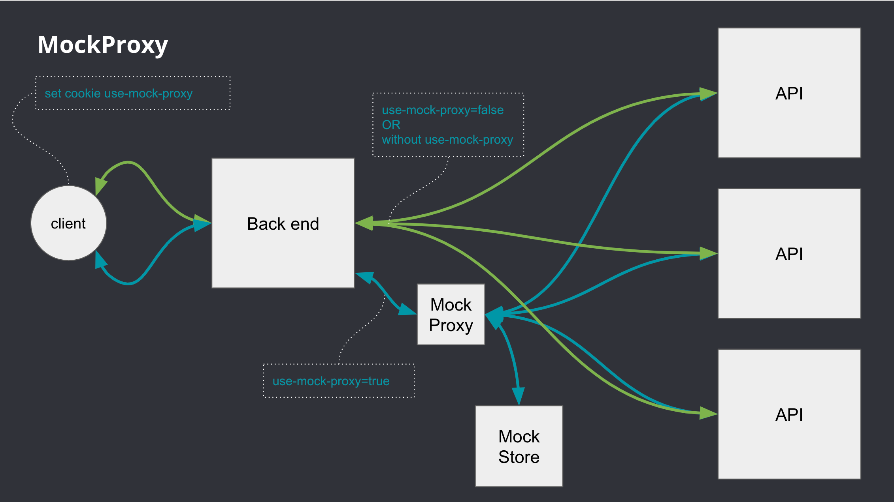

#MockProxy
MockProxy is HTTP proxy server base on [LittleProxy](https://github.com/adamfisk/LittleProxy) with web application interface base on [Spring Boot](https://github.com/spring-projects/spring-boot). 

Can be used as a proxy for some requests and a mock for other requests at the same time.

###Minimal requirements for run application:

- Java 1.8
- MongoDB server version 4.4.

###In `application.properties` you can configure:

- proxy server port
- web app port 
- connection to MongoDB
- change user/password to access for web app

###Build and run application:

- `./gradlew  bootRun`

###Usage

- CURL
```
curl --insecure --proxy http://127.0.0.1:9000 -X GET https://example.com -H "mock-proxy-project-id: 6166b03d18760069af5f352a"

curl --cacert cert.pem --proxy http://127.0.0.1:9000 -X GET https://example.com -H "mock-proxy-project-id: 6166b03d18760069af5f352a"
```

- Java API
<details>
  <summary>Click to expand</summary>

```java
import javax.net.ssl.*;
import java.security.cert.X509Certificate;
import java.io.InputStream;
import java.io.InputStreamReader;
import java.io.Reader;
import java.net.InetSocketAddress;
import java.net.Proxy;
import java.net.URL;
import java.nio.charset.StandardCharsets;
 
public class JavaClientExample {
    public static void main(String[] args) throws Exception {
        // With certificate verification
         URL keystore = JavaClientExample.class.getResource("keystore.jks");
         System.setProperty("javax.net.ssl.trustStore", keystore.getPath());
         System.setProperty("javax.net.ssl.trustStorePassword", "qwerty");
 
        // Without certificate verification
        // trustAllSetUp();
 
        String realServiceUrl = "https://mockproxy.test.it.loc/test-service/json/my-service";
 
        URL url = new URL(realServiceUrl);
 
        Proxy proxy = new Proxy(Proxy.Type.HTTP, new InetSocketAddress("127.0.0.1", 9000));
 
        HttpsURLConnection connection = (HttpsURLConnection) url.openConnection(proxy);
        // Header for identify client configuration on proxy server, required for mock response
        connection.setRequestProperty("mock-proxy-project-id", "user-test-123");
 
        // This line makes the request
        try (InputStream responseStream = connection.getInputStream()) {
            int bufferSize = 1024;
            char[] buffer = new char[bufferSize];
            StringBuilder out = new StringBuilder();
            Reader in = new InputStreamReader(responseStream, StandardCharsets.UTF_8);
            for (int numRead; (numRead = in.read(buffer, 0, buffer.length)) > 0; ) {
                out.append(buffer, 0, numRead);
            }
            // Finally we have the response
            System.out.println("Response:\n" + out.toString());
        }
    }
 
    public static void trustAllSetUp() throws Exception {
        // Create a trust manager that does not validate certificate chains
        TrustManager[] trustAllCerts = new TrustManager[]{new X509TrustManager() {
            public java.security.cert.X509Certificate[] getAcceptedIssuers() {
                return null;
            }
 
            public void checkClientTrusted(X509Certificate[] certs, String authType) {
            }
 
            public void checkServerTrusted(X509Certificate[] certs, String authType) {
            }
        }
        };
 
        // Install the all-trusting trust manager
        SSLContext sc = SSLContext.getInstance("SSL");
        sc.init(null, trustAllCerts, new java.security.SecureRandom());
        HttpsURLConnection.setDefaultSSLSocketFactory(sc.getSocketFactory());
 
        // Create all-trusting host name verifier
        HostnameVerifier allHostsValid = new HostnameVerifier() {
            public boolean verify(String hostname, SSLSession session) {
                return true;
            }
        };
 
        // Install the all-trusting host verifier
        HttpsURLConnection.setDefaultHostnameVerifier(allHostsValid);
    }
}
```
</details>

- Apache HttpClient

<details>
  <summary>Click to expand</summary>

```java
import org.apache.hc.client5.http.classic.methods.HttpGet;
import org.apache.hc.client5.http.config.RequestConfig;
import org.apache.hc.client5.http.impl.classic.CloseableHttpClient;
import org.apache.hc.client5.http.impl.classic.CloseableHttpResponse;
import org.apache.hc.client5.http.impl.classic.HttpClients;
import org.apache.hc.client5.http.impl.io.PoolingHttpClientConnectionManager;
import org.apache.hc.client5.http.socket.ConnectionSocketFactory;
import org.apache.hc.client5.http.socket.PlainConnectionSocketFactory;
import org.apache.hc.client5.http.ssl.NoopHostnameVerifier;
import org.apache.hc.client5.http.ssl.SSLConnectionSocketFactory;
import org.apache.hc.core5.http.HttpHost;
import org.apache.hc.core5.http.URIScheme;
import org.apache.hc.core5.http.config.RegistryBuilder;
import org.apache.hc.core5.http.io.entity.EntityUtils;
import org.apache.hc.core5.ssl.SSLContextBuilder;
import org.apache.hc.core5.ssl.TrustStrategy;
import org.apache.hc.core5.util.TimeValue;
 
import java.net.URL;
import java.security.cert.CertificateException;
import java.security.cert.X509Certificate;
 
public class ApacheClientExample {
 
    public static void main(String[] args) throws Exception {
        // With certificate verification
        URL keystore = JavaClientExample.class.getResource("keystore.jks");
        System.setProperty("javax.net.ssl.trustStore", keystore.getPath());
        System.setProperty("javax.net.ssl.trustStorePassword", "qwerty");
        CloseableHttpClient client = httpClient();
 
        // without certificate verification
        // CloseableHttpClient client = trustAllHttpClient();
 
        String realServiceUrl = "https://mockproxy.test.it.loc/test-service/json/my-service";
 
        HttpGet httpGet = new HttpGet(realServiceUrl);
        // Header for identify client configuration on proxy server, required for mock response
        httpGet.addHeader("mock-proxy-project-id", "user-test-123");
 
        try(CloseableHttpResponse response = client.execute(httpGet)) {
            String content = EntityUtils.toString(response.getEntity());
            System.out.println("Response:\n" + content);
        } catch (Exception ex) {
            ex.printStackTrace();
        }
    }
 
    public static CloseableHttpClient httpClient() {
        PoolingHttpClientConnectionManager cm = new PoolingHttpClientConnectionManager();
        cm.setMaxTotal(500);
        cm.setDefaultMaxPerRoute(20);
        cm.setValidateAfterInactivity(TimeValue.ofSeconds(5));
 
        // Proxy config
        HttpHost proxyHost = new HttpHost("http", "127.0.0.1", 9000);
 
        return HttpClients.custom()
                .setConnectionManager(cm)
                .setDefaultRequestConfig(
                        RequestConfig.custom()
                                .setProxy(proxyHost)
                                .build()
                )
                .disableCookieManagement()
                .build();
    }
 
    public static CloseableHttpClient trustAllHttpClient() throws Exception {
 
        TrustStrategy trustAllStrategy = new TrustStrategy() {
            public boolean isTrusted(X509Certificate[] chain, String authType) throws CertificateException {
                return true;
            }
        };
 
        SSLContextBuilder builder = new SSLContextBuilder();
        builder.loadTrustMaterial(trustAllStrategy);
        SSLConnectionSocketFactory sslsf = new SSLConnectionSocketFactory(
                builder.build(),
                NoopHostnameVerifier.INSTANCE
        );
        PoolingHttpClientConnectionManager cm = new PoolingHttpClientConnectionManager(
                RegistryBuilder.<ConnectionSocketFactory>create()
                        .register(URIScheme.HTTP.id, PlainConnectionSocketFactory.getSocketFactory())
                        .register(URIScheme.HTTPS.id, sslsf)
                        .build()
        );
 
        cm.setMaxTotal(10);
        cm.setValidateAfterInactivity(TimeValue.ofSeconds(5));
 
        // Proxy config
        HttpHost proxyHost = new HttpHost("http", "127.0.0.1", 9000);
 
        return HttpClients.custom()
                .setConnectionManager(cm)
                .setDefaultRequestConfig(
                        RequestConfig.custom()
                                .setProxy(proxyHost)
                                .build()
                )
                .disableCookieManagement()
                .build();
    }
}
```
</details>

- Spring Bean



<details>
  <summary>Click to expand</summary>

```java
@Bean
public CloseableHttpClient httpClient(@Value("${is_test_client}") boolean isTestClient) throws Exception {
    if (!isTestClient) {
        return createDefaultClient();
    }
    // HttpClient without proxy, sends request direct to origin service
    CloseableHttpClient defaultClient = createDefaultClient();
    CloseableHttpClient withProxyClient = createWithProxyClient();
    return (CloseableHttpClient) Enhancer.create(
            CloseableHttpClient.class,
            new ProxyMethodInterceptor(defaultClient, withProxyClient)
    );
}
 
 
public class ProxyMethodInterceptor implements MethodInterceptor {
 
    private final CloseableHttpClient defaultClient;
    private final CloseableHttpClient withProxyClient;
 
    public ProxyMethodInterceptor(CloseableHttpClient defaultClient, CloseableHttpClient withProxyClient) {
        this.defaultClient = defaultClient;
        this.withProxyClient = withProxyClient;
    }
 
    @Override
    public Object intercept(Object obj, Method method, Object[] args, MethodProxy proxy) throws Throwable {
        ServletRequestAttributes attrs = ((ServletRequestAttributes) RequestContextHolder.getRequestAttributes());
        if (attrs == null) {
            return proxy.invoke(defaultClient, args);
        }
        HttpServletRequest request = attrs.getRequest();
        Cookie cookie = WebUtils.getCookie(request, "use-mock-proxy");
        if (cookie == null) {
            return proxy.invoke(defaultClient, args);
        }
        if (Boolean.parseBoolean(cookie.getValue())) {
            return proxy.invoke(withProxyClient, args);
        }
        return proxy.invoke(defaultClient, args);
    }
}
```
</details>